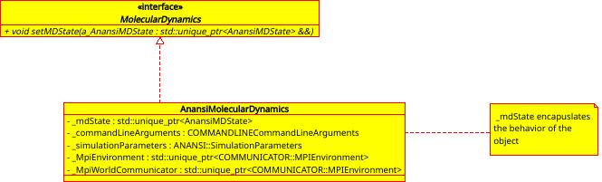
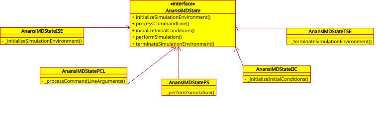
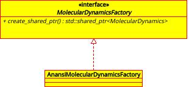

##################
molecular_dynamics
##################

This following source files are use to create the library.

Header files
============

* :ref:`anansi_main_md.h <anansi_main_md function target>`
* :ref:`AnansiMolecularDynamics.h <AnansiMolecularDynamics class target>`
* :ref:`AnansiMolecularDynamicsFactory.h <AnansiMolecularDynamicsFactory class target>`
* :ref:`MDInitInitialConditions.h <MDInitInitialConditions class target>`
* :ref:`MDInitInitialConditionsVisitor.h <MDInitInitialConditionsVisitor class target>`
* :ref:`MDInitSimEnv.h <MDInitSimEnv class target>`
* :ref:`MDInitSimEnvVisitor.h <MDInitSimEnvVisitor class target>`
* :ref:`MDNullSimulation.h <MDNullSimulation class target>`
* :ref:`MDNullSimulationVisitor.h <MDNullSimulationVisitor class target>`
* :ref:`MDPerformSimulation.h <MDPerformSimulation class target>`
* :ref:`MDPerformSimulationVisitor.h <MDPerformSimulationVisitor class target>`
* :ref:`MDProcessCmdLine.h <MDProcessCmdLine class target>`
* :ref:`MDProcessCmdLineVisitor.h <MDProcessCmdLineVisitor class target>`
* :ref:`MDSimulationStateFactory.h <MDSimulationStateFactory class target>`
* :ref:`MDTerminateSimulation.h <MDTerminateSimulation class target>`
* :ref:`MDTerminateSimulationVisitor.h <MDTerminateSimulationVisitor class target>`
* :ref:`MolecularDynamicsTypeLists.h <MolecularDynamicsTypeLists class target>`

===================
Class Relationships
===================

AnansiMolecularDynamics
-----------------------

The AnansiMolecularDynamics class is the subclass and is derived from interface
superclass MolecularDynamics. The MD objects are of type
AnansiMolecularDynamics. The behavior of the MD object is controlled by the
member attribute :cpp:member:`_mdState<AnansiMolecularDynamics::_mdState>`.

AnansiMolecularDynamics Behaviors
---------------------------------

The AnansiMolecularDynamics object behaviors are encapsulated by state clasess as
shown in the table below:

    ================= ==============================================    
    State Classes     Behavoirs                                         
    ================= ==============================================    
    AnansiMDStateISE  Initializing the simulation environment           
    AnansiMDStatePCL  Processing the command line options               
    AnansiMDStateIIC  Initializing the initial conditions               
    AnansiMDStatePS   Performing the simulation                         
    AnansiMDStateTSE  Terminating the simulation environment            
    ================= ==============================================    

AnansiMolecularDynamics Factory Class
-------------------------------------

AnansiMolecularDynamicsFactory class initiates a AnansiMolecularDynamics
object with its state set to AnansiMDStateISE.

