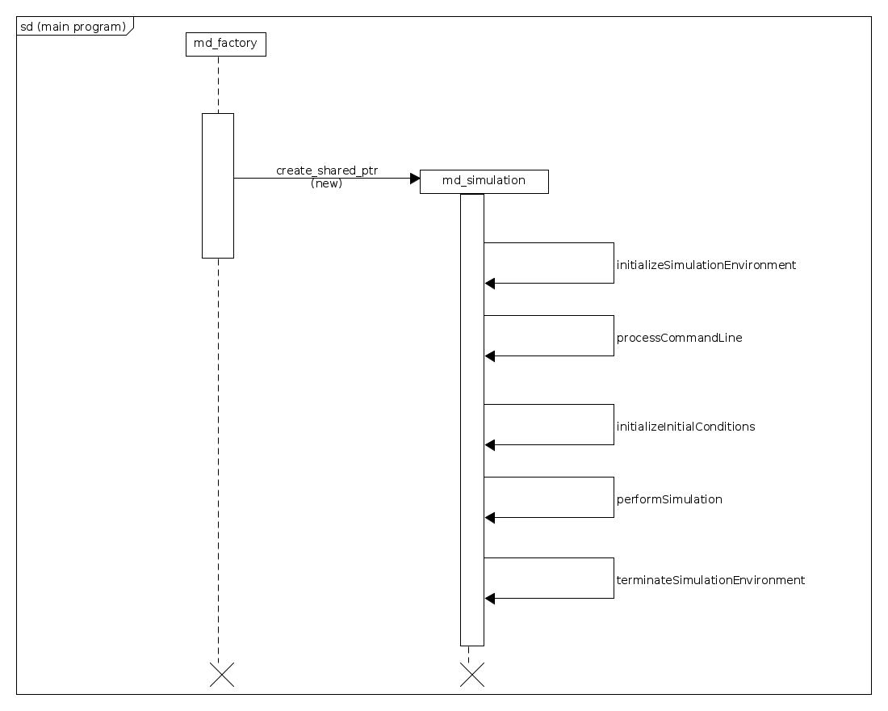

##################
molecular_dynamics
##################

This following source files are use to create the library.

Header files
============

* :ref:`anansi_main_md.{h,cpp} <anansi_main_md function target>`
* :ref:`AnansiMolecularDynamics.{h,cpp} <AnansiMolecularDynamics class target>`
* :ref:`AnansiMolecularDynamicsFactory.{h,cpp} <AnansiMolecularDynamicsFactory class target>`
* :ref:`MDInitInitialConditions.{h,cpp} <MDInitInitialConditions class target>`
* :ref:`MDInitInitialConditionsVisitor.{h,cpp) <MDInitInitialConditionsVisitor class target>`
* :ref:`MDInitSimEnv.{h,cpp} <MDInitSimEnv class target>`
* :ref:`MDInitSimEnvVisitor.{h,cpp} <MDInitSimEnvVisitor class target>`
* :ref:`MDNullSimulation.{h,cpp} <MDNullSimulation class target>`
* :ref:`MDNullSimulationVisitor.{h,cpp} <MDNullSimulationVisitor class target>`
* :ref:`MDPerformSimulation.{h,cpp} <MDPerformSimulation class target>`
* :ref:`MDPerformSimulationVisitor.{h,cpp} <MDPerformSimulationVisitor class target>`
* :ref:`MDProcessCmdLine.{h,cpp} <MDProcessCmdLine class target>`
* :ref:`MDProcessCmdLineVisitor.{h,cpp} <MDProcessCmdLineVisitor class target>`
* :ref:`MDSimulationStateFactory.{h,cpp} <MDSimulationStateFactory class target>`
* :ref:`MDTerminateSimulation.{h,cpp} <MDTerminateSimulation class target>`
* :ref:`MDTerminateSimulationVisitor.{h,cpp} <MDTerminateSimulationVisitor class target>`
* :ref:`MolecularDynamicsTypeLists.{h,cpp} <MolecularDynamicsTypeLists class target>`

===================
Main Program
===================

The main program source file is anansi\_main\_md.{cpp,h} and its UML sequence
diagram is below. The md\_factory is an :ref:`AnansiMolecularDynamicsFactory <AnansiMolecularDynamicsFactory class target>`  object,
and the md\_simulation is an :ref:`AnansiMolecularDynamics <AnansiMolecularDynamics class target>` object.

===================
Class Relationships
===================

-----------------------
AnansiMolecularDynamics
-----------------------

The primary class of this library is AnansiMolecularDynamics for it is the
top in the *kickstarter* class of doing molecular dynamics simulations - the 
main program initiates an AnansiMolecularDynamics object and then invokes its 
appropriate methods.

---------------------------------
AnansiMolecularDynamics Behaviors
---------------------------------

An AnansiMolecularDynamics object has behaviors
uses  a state design pattern for altering its behavior. The below table
lists the behaviors and the corresponding state classes which implement them. 

=======================================     =================================
Behaviors                                   State Classes
=======================================     =================================
Null                                        MDNullSimulation
Initializing the Simulation Environment     MDInitSimEnv
Processing the Command Line Arguments       MDProcessCmdLine
Performing the Simulation                   MDPerformSimulation
Terminating the Simulation                  MDTerminateSimulation
=======================================     =================================

-------------------------------------
AnansiMolecularDynamics Factory Class
-------------------------------------

The class AnansiMolecularDynamicsFactory is the factory class for
AnansiMolecularDynamics objects, and it's mandatory that one uses
AnansiMolecularDynamicsFactory to instantiate AnansiMolecularDynamics objects. 
There is hard limit 1 instantiated AnansiMolecularDynamics object.  

--------------------------------------
AnansiMolecularDynamics Vistor Classes
--------------------------------------

The AnansiMolecularDynamics behaviors are implemented by specializations from
visitor classes listed in the table below.

=======================================     =================================
Behaviors                                   State Classes
=======================================     =================================
Null                                        MDNullSimulationVisitor
Initializing the Simulation Environment     MDInitSimEnvVisitor
Processing the Command Line Arguments       MDProcessCmdLineVisitor
Performing the Simulation                   MDPerformSimulationVisitor
Terminating the Simulation                  MDTerminateSimulationVisitor
=======================================     =================================

