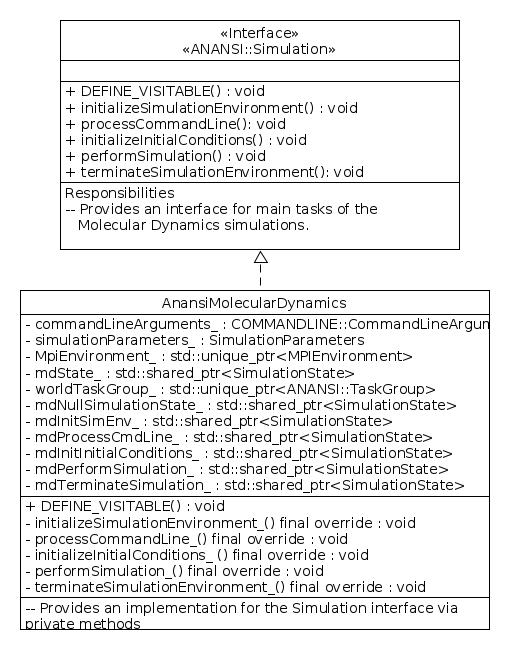

============
Introduction
============

Anansi is a computational molecular simulation software package designed
to be run on Linux like computers. The program can run in a serial or
parallel MPI mode.

####################
Anansi Source Layout
####################

We now provide an overview of the source code layout of Anansi.

Anansi's toplevel layout is shown in the following diagram:

and a brief description is given in the table below: 

============================= ===========
Element                       Description
============================= ===========
*bin/*                        Contains helper scripts for building Anansi and Anansi's documentation
CMakeLists.txt*               The toplevel CMakefileLists.txt file
*cmake_macros_and_functions/* Contains CMake macros and functions
*configurations/*             Contains architecture configuration files for machines at notable HPC centers 
*documentation/*              Contains Sphinx documentation source files, diagrams and other files that aid towards building Anansi's documentation
*sources/*                    Contains Anansi's source files
*templates/*                  Contains source file templates to ease writing new source files
============================= ===========

