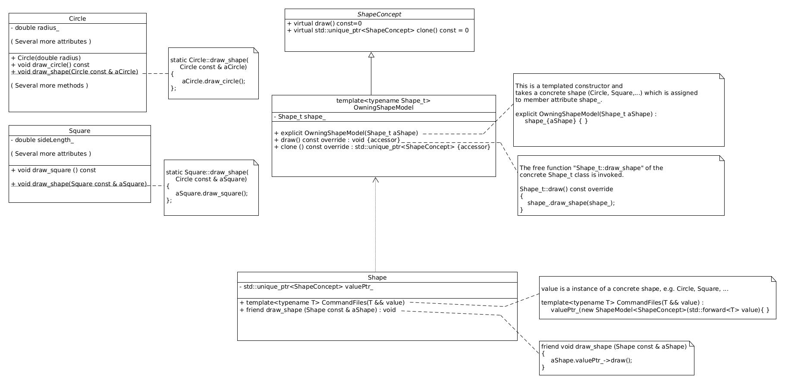

# TypeErasure Inheritance {#TypeErasureInheritance}

TypeErasure inheritance, as explained by Iglberger [1],

> Provides a value based, non-intrusive value based abstraction for an extendable
> set of unrelated  potential non-polymorphic types with the same semantic behavior. (p. 301)

The TypeErasure UML diagram is depicted below.

We can group  the TypeErasure design pattern into 3 levels. The high level consists of the classes
`ShapeConcept` and `OwningShapeModel`. The middle level consists of the class `Shape`, and the low level
consists of the concrete classes `Circle` and `Square`.

The high level provides the semantic requirements for all shape types. For example, one can require
all shapes to provide a draw functionality. The class `ShapeConcept` is the base class that defines
the shapes semantic requirements. Note that in `ShapeConcept` the abstract virtual method named
`draw` sets the shapes draw semantic. The class `OwningShapeModel` is a templated class whose
template parameters are of concrete shape types 

    template <typename T> 
    class OwningShapeModel<T>;

and constructor takes a concrete shape, e.g. `Circle`, `Square`, e.t.c., that is used to
initialize the data member `OwningShapeModel::concreteShape_`. 

    template <typename T>
    explcit OwningShapeModel<T>::OwningShapeModel( T & aConcreteShape) :
    concreteShape_{aConcreteShape};

In addition `OwningShapeModel` must override all virtual functions of `ShapeConcept`. `ShapeConcept`
has virtual functions  `ShapeConcept::draw` and `ShapeConcept::clone`. A possible implementation 
of the `OwningShapeModel::draw` is listed below.

    OwningShapeModel::draw() const override
    {
        shape_.draw_shape(shape_);
    }

The middle level class `Shape` wraps and transforms the high level hierarchy to value semantics and
a TypeErasure. Note that only `Shape's` constructor is templated on a concrete shape

    template<typename T>
    Shape::Shape(T && aConcreteShape) :
    valuePtr_(new ShapeModel<ShapeConcept>(std::forward<T>(aConcreteShape)));

where the concrete shape is wrapped in `Shape::valuePtr_` 

    std::unique_ptr<ShapeConcept> Shape::valuePtr_;

The `Shape` class has a hidden friend function [2]  `draw()`.

    friend void draw_shape(Shape const  & aShape)
    {
        aShape.valuePtr_->draw();
    }

The below listing is an example of the use:

    // ------
    // <Main.cpp>
    // ------

    #include "Circle.h"
    #include "Shape.h"

    int main(int argc,char**argv
    {
        // Create a concrete circle shape
        Circle aCircle(7.0);

        // Create a TypeErasure for the concrete circle aCircle
        Shape shape1(aCircle);

        // Draw the shape using the hidden friend of class Shape.
        draw_shape(shape1);

        return EXIT_SUCESS;
    }

---

[1] Iglberger, K. (2022). <EM>C++ Software Design. </EM> (First Edition).  O'Reilly Media. ISBN: 9781098113162.  
[2]  Williams, A. (2019, June 27). The Power of Hidden Friends in C++. Just Software Solutions. <EM>https://www.justsoftwaresolutions.co.uk/cplusplus/hidden-friends.html</EM>  
